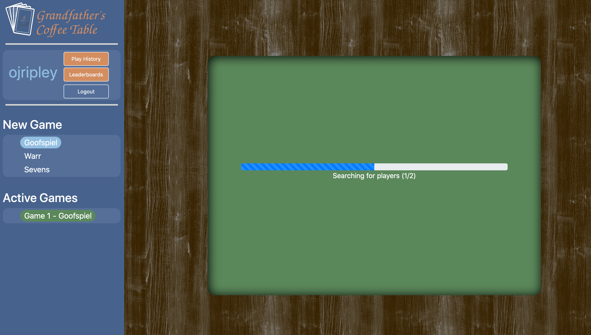
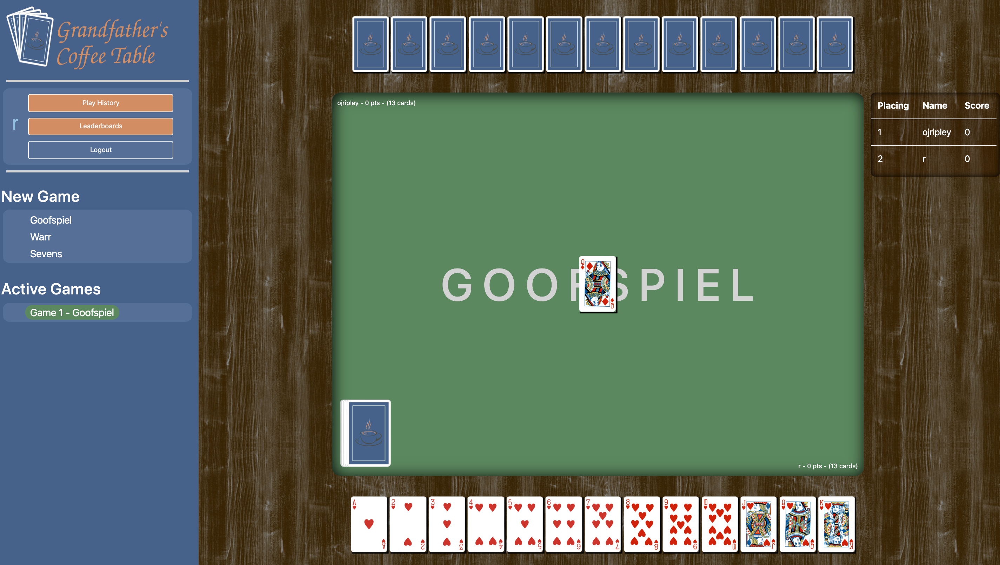
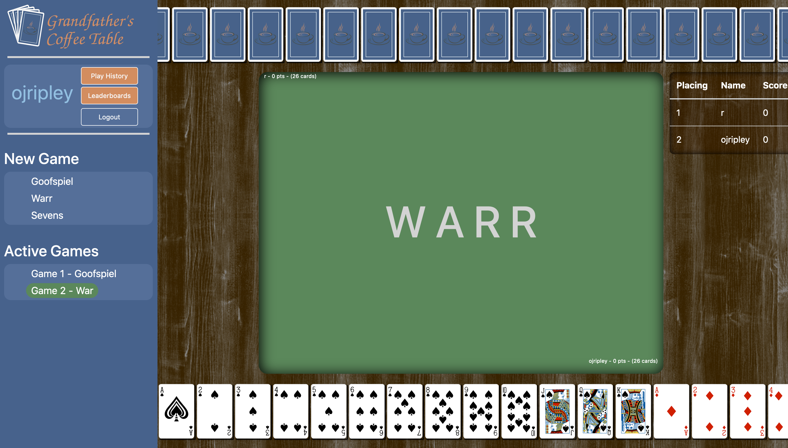
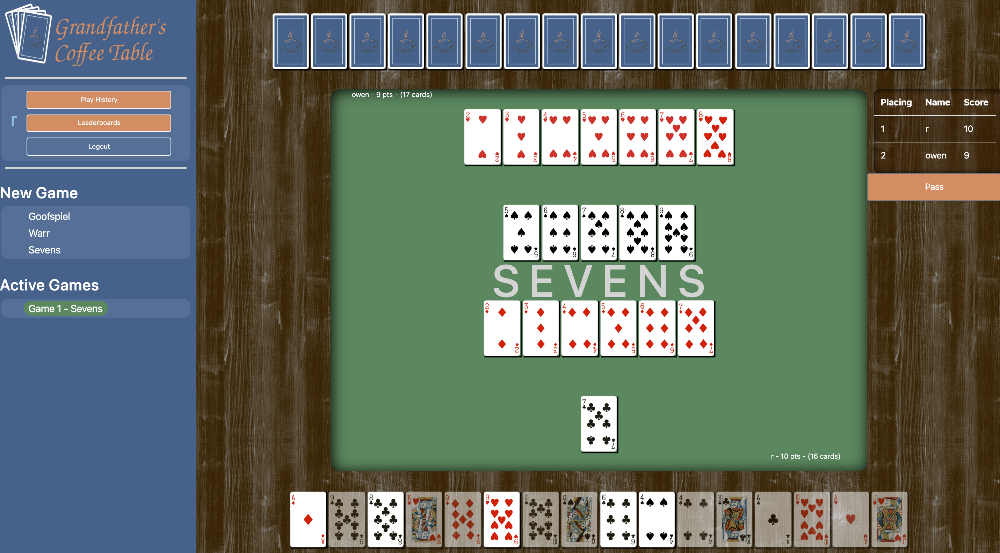
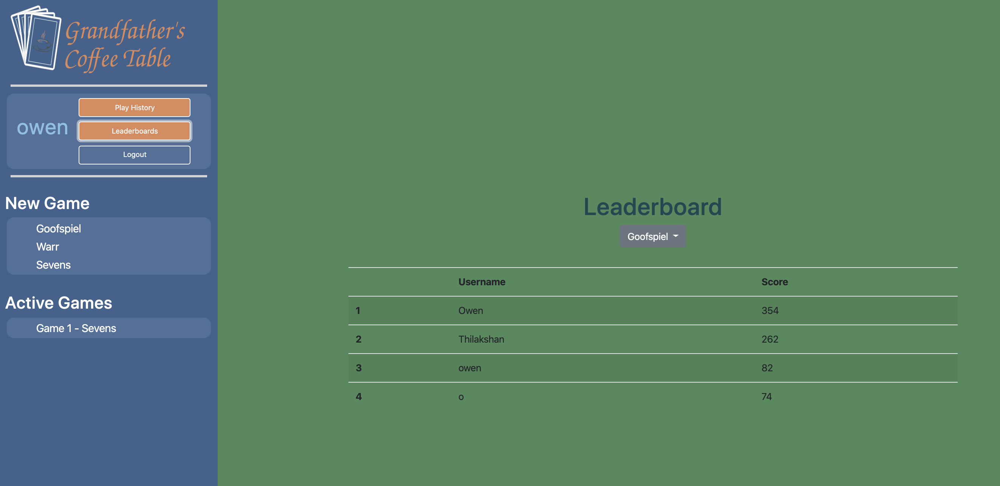

# Grandfather's Coffee Table
Grandfather's Coffee Table is a single page multiplayer web application . Players can register to the database and play games with each other in realtime. The application currently supports three game modes: Goofspiel, Warr, and Sevens.  The application c

## Project Setup
To host your own version of Grandfather's Coffee Table you should
 1. Run `npm install`
 2. Run `npm run local` to start the server
 3. Go to `localhost:8080` on your browser
 4. If running properly, the server will log to terminal that a player has connected

## Features

Registration page.

The landing page where players can select a gamemode, view the leaderboards, or their profile.

When a user selects a game they will be put into a lobby where they will be matched with an opponent.

### Goofspiel

In the goofspiel gamemode two players start with 13 card of the same suit. Each player starts with 13 cards (one of each suit), and bids. The player who bids the highest card wins the round and is awarded points based on the value of the card. Aces are worth 1 point and kings are worth 13 points.

### Warr

Warr is an non-traditional take on the game of war where players are able to select a card to play against an opponent. The person with the highest card wins the round and gets the cards from the table. This gamemode is not recommended as there is an optimal strategy that results in a perpetual draw. Nevertheless, the gamemode is a simple demonstration that the application can be extended to other gamemodes involving card transferring between players. Points are awarded at the end based on the number of cards in the players hand at the end of the game.

### Sevens

Sevens is a game where players may play to one of four rows cards. However, cards can only be played to rows of the same suit and must be played next to a card of a point value one higher or lower. However, a 7 can be played at any time to 'break' the row open. The game is started by the player who is randomly assigned the 7 of hearts. A point is assigned for each card that the opponent plays.

### Notifications

Users will be promopted with both a card notification and badge indicating that a player has made a move on a board they are not watching (the notifications will not appear if the user is already watching the gmae).

### Leaderboards

Once a game is completed, the match is registered to a database. The leaderboard for the database can be accessed for each game type.

### Profile

Players can access their profile page where their complete match history can be seen. Hovering over a match will display the match details (other players who were in the match and their placing). Players may also search for other users to see their match history.

## Dependencies

- Node 10.x or above
- NPM 5.x or above
- PG 6.x

## Built with
- NodeJS
- PostgreSQL
- Socket.io
- ES6
- Express.js
- JQuery
- Bootstrap

# Features to be added
- Having players be able to reconnect
- Improvements to the notification system

# Contributors
Created by @owenripley and @ThilakshanArulnesan.
